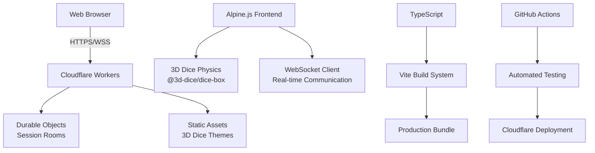

# DaggerDice Documentation

Welcome to the DaggerDice documentation! DaggerDice is a 3D dice rolling web application designed for tabletop RPG sessions, featuring Hope/Fear mechanics and real-time multiplayer collaboration.

🎲 **[Launch DaggerDice](https://daggerdice.smileychris.workers.dev)** 🎲

## User Documentation

Perfect for players, Game Masters, and content creators who want to use DaggerDice:

### 📚 **[Getting Started](getting-started.md)**
Complete user guide covering:
- Quick start for solo and multiplayer use
- Roll types explained (Check, Damage, GM)
- Multiplayer session creation and joining
- Keyboard shortcuts and tips
- Troubleshooting common issues

### ✨ **[Features Overview](features.md)**
Comprehensive feature documentation:
- Core dice system (Hope & Fear mechanics)
- 3D physics simulation and themes
- Real-time multiplayer features
- Mobile optimization and accessibility
- Privacy controls and Streamer Mode

## Technical Documentation

For developers, contributors, and those interested in the technical implementation:

### 🔧 **[Development Guide](development.md)**
Complete developer documentation:
- Project architecture and technology stack
- Local development setup
- Testing strategy and CI/CD pipeline
- Code style and contribution guidelines
- Advanced configuration options

### 🌐 **[Multiplayer Technical Architecture](multiplayer-technical.md)**
Deep dive into the multiplayer system:
- WebSocket connection management
- Cloudflare Workers and Durable Objects
- Message protocol and data flow
- Reconnection strategies and error handling
- Performance characteristics and monitoring

## Quick Overview

DaggerDice is a modern web application that provides:

- **🎲 Hope & Fear Dice System**: D12-based mechanics with critical success detection
- **🎯 Multiple Roll Types**: Check, Damage, and GM rolls with full customization
- **🌐 Real-time Multiplayer**: WebSocket-based sessions with automatic reconnection
- **📱 Mobile Optimized**: Responsive design with touch-friendly interfaces
- **🎬 Streamer Mode**: Privacy controls for content creators
- **⚡ 3D Physics**: Realistic dice rolling with WebGL/WASM simulation
- **🔧 Developer Friendly**: Open source with comprehensive documentation

## Architecture Overview

## Getting Help

- **🐛 Bug Reports**: [GitHub Issues](https://github.com/smileychris/daggerdice/issues)
- **💡 Feature Requests**: [GitHub Discussions](https://github.com/smileychris/daggerdice/discussions)
- **📖 Documentation**: Browse the guides above
- **💻 Source Code**: [View on GitHub](https://github.com/smileychris/daggerdice)

## Quick Navigation

| For Users | For Developers |
|-----------|----------------|
| [Getting Started](getting-started.md) | [Development Guide](development.md) |
| [Features](features.md) | [Multiplayer Technical](multiplayer-technical.md) |
| [Troubleshooting](getting-started.md#troubleshooting) | [Contributing](development.md#contributing-guidelines) |
| [Browser Requirements](getting-started.md#browser-requirements) | [Testing](development.md#testing-strategy) |

---

**Ready to start rolling?** [Launch DaggerDice now!](https://daggerdice.smileychris.workers.dev) 🎲