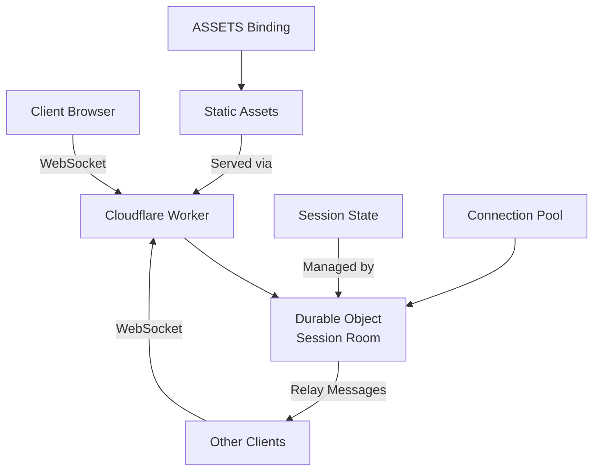

# Multiplayer Technical Architecture

This document provides detailed technical information about DaggerDice's multiplayer system, including connection handling, message flow, and deployment architecture.

## Architecture Overview

DaggerDice uses a hybrid peer-to-peer and relay architecture built on Cloudflare Workers and Durable Objects to enable real-time multiplayer dice rolling sessions.



## Connection Management

### WebSocket Protocol

DaggerDice establishes WebSocket connections through Cloudflare Workers at the endpoint:
- **Development**: `ws://localhost:8787/api/room/{sessionId}`
- **Production**: `wss://daggerdice.smileychris.workers.dev/api/room/{sessionId}`

### Connection Lifecycle

#### 1. Connection Establishment
```typescript
// Client connects to a 6-character session ID
const wsUrl = `${protocol}//${window.location.host}/api/room/${sessionId}`;
this.websocket = new WebSocket(wsUrl);
```

#### 2. Player Registration
Upon connection, the client sends a `JOIN_ANNOUNCEMENT` message:
```typescript
{
  type: 'JOIN_ANNOUNCEMENT',
  player: {
    id: string,        // Generated client-side (8-char random)
    name: string,      // Sanitized player name (max 20 chars)
    joinedAt: number,  // Timestamp
    lastSeen: number,  // Timestamp
    isActive: boolean  // Always true on join
  }
}
```

#### 3. Peer Discovery
Existing players respond with `PLAYER_RESPONSE` messages to share their information with the new player.

### Reconnection Strategy

The system implements exponential backoff reconnection:

- **Max Attempts**: 5 reconnection attempts
- **Initial Delay**: 1 second
- **Backoff**: Exponential (delay × 2^attempt)
- **Auto-Reconnect Triggers**:
  - Window focus events
  - Visibility change events
  - Connection loss (non-manual disconnects)

```typescript
private reconnectDelay = 1000; // Start with 1 second
setTimeout(() => {
  this.attemptReconnect(playerName);
}, this.reconnectDelay * Math.pow(2, this.reconnectAttempts));
```

### Connection Health Monitoring

#### Heartbeat System
- **Ping Interval**: 30 seconds
- **Pong Timeout**: 10 seconds
- **Health Check**: Validates pong received within 60 seconds

```typescript
public isConnectionHealthy(): boolean {
  const timeSinceLastPong = Date.now() - this.lastPongReceived;
  return timeSinceLastPong < 60000;
}
```

## Message Types and Flow

### Core Message Types

| Message Type | Direction | Purpose |
|--------------|-----------|---------|
| `JOIN_ANNOUNCEMENT` | Client → Server | Player joins session |
| `PLAYER_RESPONSE` | Client → Server | Response to join announcement |
| `LEAVE_ANNOUNCEMENT` | Client → Server | Player leaves session |
| `ROLL` | Client → Server | Broadcast dice roll results |
| `HISTORY_SHARE` | Client → Server | Share roll history with new players |
| `PING` / `PONG` | Bidirectional | Connection health monitoring |

### Message Relay Architecture

The Durable Object acts as a message relay:

```typescript
private relayMessage(message: ClientMessage, senderWs: WebSocket): void {
  const messageStr = JSON.stringify(message);
  
  // Send to all connections except sender
  for (const ws of this.connections) {
    if (ws !== senderWs && ws.readyState === WebSocket.READY_STATE_OPEN) {
      ws.send(messageStr);
    }
  }
}
```

### Roll Data Broadcasting

When a player rolls dice, the complete roll data is broadcast:

```typescript
interface SharedRollHistoryItem extends RollData {
  playerId: string;    // Unique player identifier
  playerName: string;  // Display name
  timestamp: number;   // UTC timestamp
}
```

## Session Management

### Session ID Format
- **Length**: 6 characters
- **Character Set**: Alphanumeric `[a-z0-9]`
- **Validation**: Regex `/^[a-z0-9]{6}$/i`

### Durable Object State Management

Each session is managed by a dedicated Durable Object instance:

```typescript
// Session routing
const roomId = env.SESSION_ROOMS.idFromName(sessionId);
const roomStub = env.SESSION_ROOMS.get(roomId);
```

### Connection Pool Management

The Durable Object maintains a Set of active WebSocket connections:

```typescript
private connections: Set<WebSocket> = new Set();

// Auto-cleanup on disconnect
server.addEventListener('close', () => {
  this.connections.delete(server);
});
```

## Roll History Synchronization

### History Keeper Algorithm

To prevent duplicate history sharing, DaggerDice uses a deterministic history keeper selection:

1. **Selection Criteria**: Alphabetically first player ID among connected players
2. **Exclusion Logic**: When a new player joins, existing players (excluding the new player) determine the keeper
3. **History Sharing**: Only the designated keeper sends `HISTORY_SHARE` messages

```typescript
private isHistoryKeeperExcluding(excludePlayerId: string): boolean {
  const existingPlayerIds = [this.playerId, ...this.connectedPlayers.keys()]
    .filter(id => id !== excludePlayerId);
  const uniquePlayerIds = [...new Set(existingPlayerIds)];
  uniquePlayerIds.sort();
  return uniquePlayerIds[0] === this.playerId;
}
```

### History Filtering

Private GM rolls are filtered during history sharing:

```typescript
const publicHistory = this.localRollHistory.filter(roll => 
  !(roll.rollType === 'gm' && roll.gmPrivate)
);
```

## Security and Privacy

### Input Sanitization

Player names are sanitized to prevent XSS:

```typescript
private sanitizePlayerName(name: string): string {
  const sanitized = name.trim().substring(0, 20);
  return sanitized.replace(/<[^>]*>/g, '') || 'Anonymous';
}
```

### Connection Security

- **HTTPS Required**: Production multiplayer requires HTTPS
- **Origin Validation**: WebSocket connections validated by Cloudflare Workers
- **Rate Limiting**: Implicit through Cloudflare Workers limits

### Privacy Features

- **Streamer Mode**: Hides room codes and QR codes
- **Private GM Rolls**: Can be excluded from shared history
- **Local Storage**: Session data stored locally, not server-side

## Deployment Architecture

### Cloudflare Workers Configuration

```toml
# wrangler.toml
[assets]
directory = "./dist/client"
binding = "ASSETS"

[[durable_objects.bindings]]
name = "SESSION_ROOMS"
class_name = "SessionDurableObject"
```

### Request Routing

1. **WebSocket Requests**: `/api/room/{sessionId}` → Durable Object
2. **Static Assets**: `/*` → ASSETS binding
3. **SPA Routing**: 404 non-file requests → `index.html`

### Durable Object Lifecycle

- **Creation**: On-demand when first client connects to session ID
- **Persistence**: Automatic hibernation when no active connections
- **Cleanup**: Automatic garbage collection after inactivity

## Error Handling and Resilience

### Connection Failure Recovery

```typescript
// Connection state management
export type ConnectionState = 'disconnected' | 'connecting' | 'connected' | 'error';

// Graceful degradation
if (!this.available) {
  console.warn('Session features not available');
  return false; // Fall back to solo mode
}
```

### Message Delivery Guarantees

- **At-most-once delivery**: No message duplication
- **Best-effort delivery**: No guaranteed delivery (WebSocket nature)
- **Idempotent operations**: Roll history can handle duplicate entries

### Browser Compatibility

- **WebSocket Support**: Required for multiplayer functionality
- **LocalStorage**: Used for session persistence
- **Modern Browsers**: ES6+ features used throughout

## Performance Characteristics

### Scalability Limits

- **Concurrent Connections**: Limited by Cloudflare Workers WebSocket limits
- **Message Throughput**: Optimized for low-frequency dice rolls
- **Memory Usage**: Minimal state stored in Durable Objects

### Latency Optimization

- **Edge Deployment**: Cloudflare's global edge network
- **Message Size**: Minimal JSON payloads
- **Connection Reuse**: Persistent WebSocket connections

## Monitoring and Debugging

### Client-Side Logging

```typescript
console.log('WebSocket connected');
console.log('Broadcasting roll with player ID:', playerId);
console.warn('Connection failed after multiple attempts');
```

### Server-Side Observability

- **Durable Object Logs**: Available in Cloudflare dashboard
- **WebSocket Metrics**: Connection counts and message rates
- **Error Tracking**: Built-in Cloudflare Workers error reporting

## Development and Testing

### Local Development Setup

```bash
# Start local worker with Wrangler
npm run dev:worker

# WebSocket endpoint becomes available at:
# ws://localhost:8787/api/room/{sessionId}
```

### Testing Strategy

- **Unit Tests**: Session client logic (`session-client.test.ts`)
- **Integration Tests**: Worker functionality (`worker.test.ts`)
- **Manual Testing**: Real WebSocket connections in development

This architecture provides a robust, scalable foundation for real-time multiplayer dice rolling while maintaining simplicity and cost-effectiveness through Cloudflare's serverless platform.